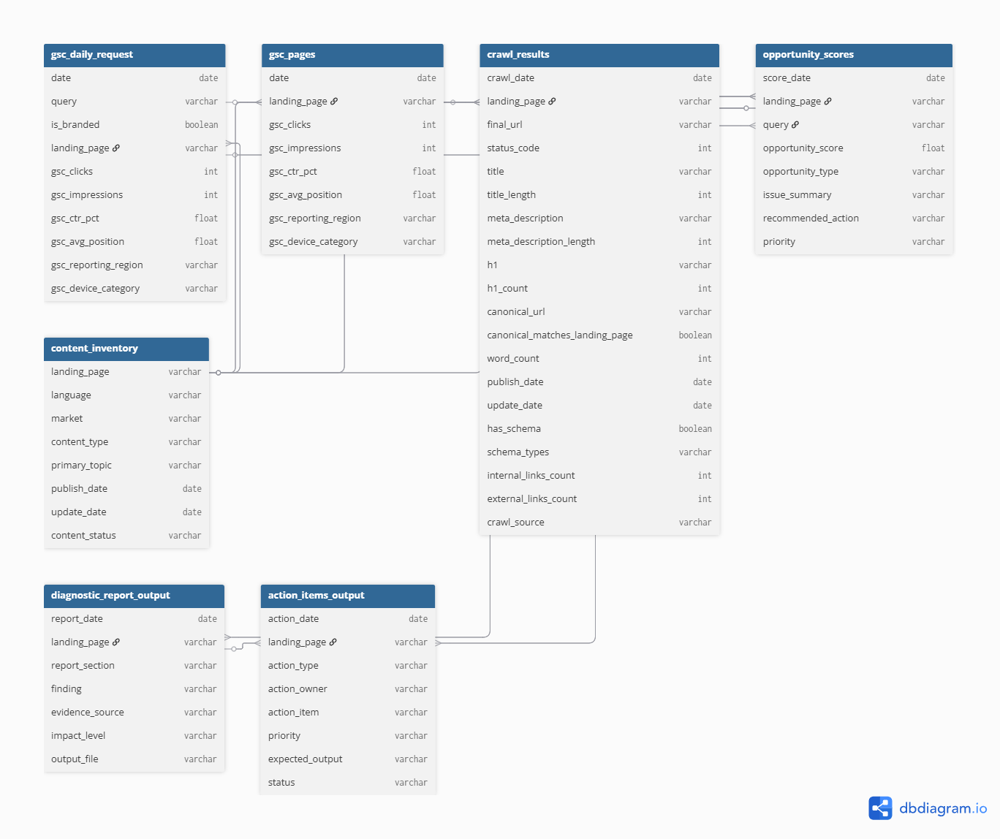

# SEO Diagnostic ER Diagram

This document explains the ER diagram for the `seo_diagnostic` warehouse.

The diagram was created with dbdiagram.io using the DBML source file:

```text
docs/seo-diagnostic-er.dbml
```

## Diagram



## Output

The M0W2D4 output is an ER diagram that visualises the relationship between input data, diagnostic tables, and execution outputs.

| Output | Location | Purpose |
|---|---|---|
| DBML source | `docs/seo-diagnostic-er.dbml` | Editable source code for dbdiagram.io. |
| ER diagram image | `docs/er-diagram.png` | Visual database relationship diagram. |
| ER documentation | `docs/er-diagram.md` | Human-readable explanation of the schema relationships. |

## Core Tables

| Table | Role |
|---|---|
| `gsc_daily_request` | Query-level Google Search Console performance data. |
| `gsc_pages` | Page-level Google Search Console performance data. |
| `crawl_results` | Technical and on-page crawl diagnostics. |
| `content_inventory` | Master content metadata table. |
| `opportunity_scores` | Prioritised SEO opportunity table. |

## Output Tables

| Table | Role |
|---|---|
| `diagnostic_report_output` | Future reporting artifact showing page-level findings and evidence. |
| `action_items_output` | Future execution artifact showing recommended tasks, owners, priorities, and status. |

## Join Keys

| Relationship | Join Key | Purpose |
|---|---|---|
| `content_inventory` to `gsc_daily_request` | `landing_page` | Join content metadata with query-level search performance. |
| `content_inventory` to `gsc_pages` | `landing_page` | Join content metadata with page-level search performance. |
| `content_inventory` to `crawl_results` | `landing_page` | Join content metadata with technical SEO crawl diagnostics. |
| `content_inventory` to `opportunity_scores` | `landing_page` | Join content metadata with prioritised opportunities. |
| `gsc_daily_request` to `opportunity_scores` | `landing_page`, `query` | Connect search demand with opportunity scoring. |

## Action Items

- Export the dbdiagram.io diagram as `docs/er-diagram.png`.
- Keep `docs/seo-diagnostic-er.dbml` as the editable diagram source.
- Use `landing_page` as the primary join key across page-level tables.
- Use `landing_page + query` for query-level opportunity scoring.
- Treat `diagnostic_report_output` and `action_items_output` as future output artifacts, not required BigQuery core tables for M0.